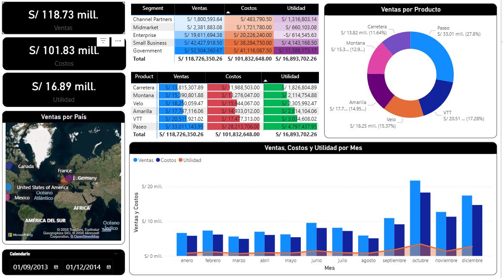
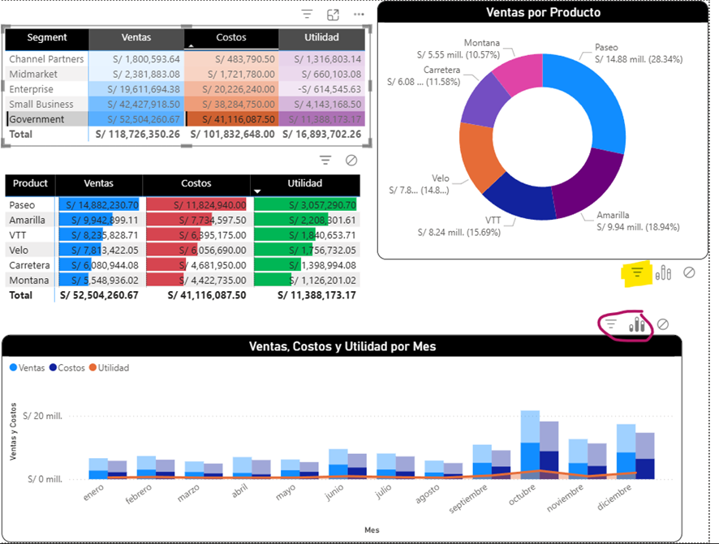
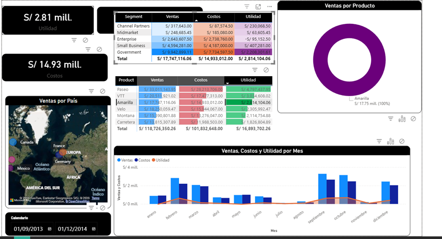
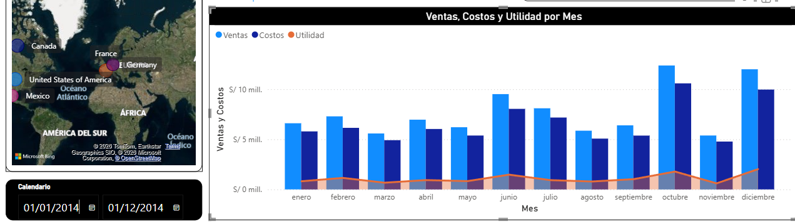

# Dashboard de PowerBI de una tabla Excel

## Explicación
Se desarrolló un dashboard en Power BI con el objetivo de analizar el registro de ventas, costos y utilidades de la empresa, utilizando la información contenida en la tabla Financial Sample.
El análisis considera diferentes dimensiones clave, como:

- Productos

- Segmentos de negocio

- Países

- Fechas (análisis mensual y rango de fechas)

## Elementos y visualizaciones implementadas
Para lograr un análisis completo, se realizaron las siguientes visualizaciones:

### Indicadores principales en las tarjetas:

- Total de Ventas: S/ 118.73 millones

- Total de Costos: S/ 101.83 millones

- Total de Utilidad: S/ 16.89 millones

### Análisis por Segmento:

- Matriz para la comparativa de ventas, costos y utilidad por segmento (Government, Small Business, Enterprise, Midmarket y Channel Partners).

- Permite identificar qué segmento genera mayor rentabilidad.

### Análisis por Producto:

- Matriz y gráfico de anillo que muestran la participación de cada producto en las ventas totales.

- Comparación directa entre ventas, costos y utilidad por producto.

### Análisis geográfico (Ventas por País):

- Mapa interactivo que muestra la distribución de ventas en distintos países con las burbujas.

- Facilita identificar mercados con mayor volumen de ventas.

### Análisis temporal:

- Gráfico combinado de ventas, costos y utilidad por mes.

- Segmentador de fechas (Calendario) que permite analizar periodos específicos.

## Consideraciones para recordar 
Durante la construcción del dashboard se tomó en cuenta:
- Diseño visual enfocado en la claridad y sencillez utilizando principalmente, títulos con fondo negro, letras blancas y borde visual negro con redondeado 12
- Se editó interaccioness manualmente 
    
    Se seleccionó el icono de filtro resaltado en la imagen anterior, y se repetió el proceso en los demás elementos.
    Resultado:
    
    
## Observaciones

A partir del análisis del dashboard, se pueden destacar las siguientes observaciones:

- El segmento Government y Small Business concentran los mayores niveles de ventas, siendo también los que más aportan a la utilidad total.

- Algunos productos, como Paseo y VTT, representan una alta participación en las ventas, pero también presentan costos elevados, lo que reduce su margen de utilidad.

- La utilidad total es significativamente menor que las ventas, lo que indica la importancia de optimizar costos para mejorar la rentabilidad.

- En el último año se observa un incremento de ventas en julio, octubre y diciembre, especialmente en los últimos dos.

- Las ventas por país son similares, siendo México el país con menos ventas, podría representar una oportunidad de crecimiento. Por otro lado, Estados Unidos destaca como el país con mayor volumen de ventas, posicionándose como el principal mercado para la empresa. 